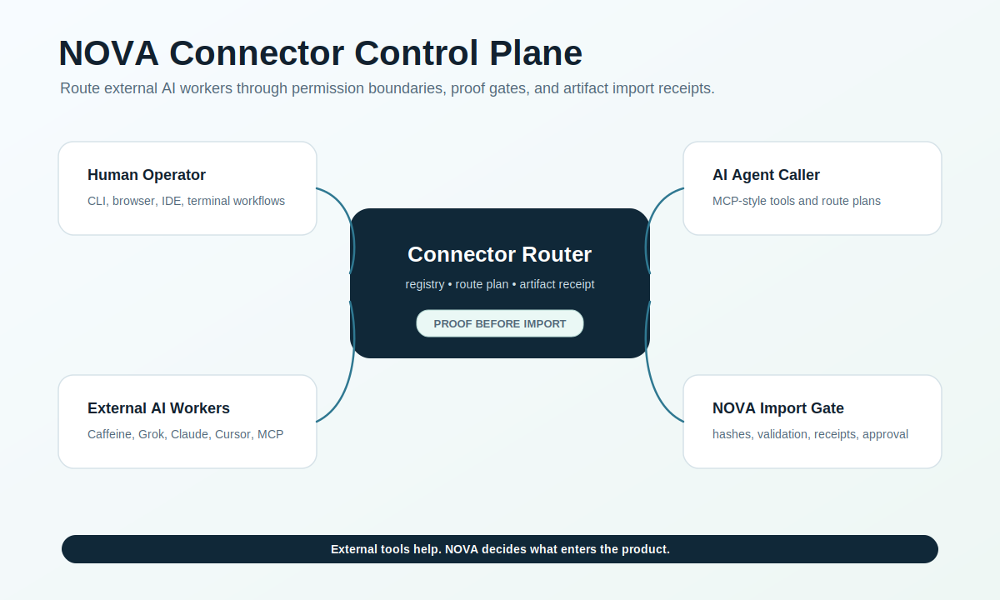

# NOVA Connector Control Plane




Dedicated production home for connector routing, connectorctl, live MCP discovery, and artifact import dashboards.

This repo turns external AI systems into governed worker surfaces. Caffeine, Grok Build, Claude Code, Cursor, Antigravity, browser workbenches, generic MCP servers, and ChatGPT app/OAuth flows can be discovered, routed, and imported through proof gates.

## Human Flow

1. Validate connectors.
2. Pick a worker surface.
3. Generate a route plan.
4. Review permission boundary and proof gates.
5. Import artifacts only with hash and validation status.

See `docs/HUMAN_AI_WORKFLOWS.md` for human and AI worker flows.

## Quick Start

```bash
python tools/connectorctl.py validate
python tools/connectorctl.py list
python tools/connectorctl.py describe caffeine-mtp-bridge
python tests/smoke_test.py
python benchmarks/benchmark_routes.py
```

Run the local API:

```bash
python server/connector_control_plane.py --port 8770
```

Call the API:

```bash
curl http://127.0.0.1:8770/health
curl http://127.0.0.1:8770/connectors
curl http://127.0.0.1:8770/connectors/generic-mcp-gateway
curl -s -X POST http://127.0.0.1:8770/route -H 'content-type: application/json' -d @examples/route-plan.json
curl -s -X POST http://127.0.0.1:8770/artifacts/import -H 'content-type: application/json' -d @examples/artifact-import.json
```

## Platform Surfaces

| Surface | Path |
| --- | --- |
| Platform manifest | `nova-connector-control-plane.manifest.json` |
| Connector registry | `data/connectors.json` |
| API server | `server/connector_control_plane.py` |
| CLI | `tools/connectorctl.py` |
| MCP manifest | `mcp/connector-control-plane.mcp.json` |
| Smoke tests | `tests/smoke_test.py` |
| Benchmarks | `benchmarks/benchmark_routes.py` |
| CI | `.github/workflows/ci.yml` |
| Workflows | `docs/HUMAN_AI_WORKFLOWS.md` |

## Operating Law

- External AIs are worker surfaces, not crown authority.
- Connector outputs are untrusted until proof is captured.
- Artifact imports require hash, validation status, and operator review.
- Unsafe execution remains blocked by default.
- This repo owns runtime routing; `x-mcp-skills` owns reusable connector skill contracts.

## Search Keywords

NOVA connector control plane, MCP connector registry, external AI connector platform, AI worker routing, Caffeine MCP bridge, Grok Build connector, Claude Code bridge, Cursor AI workflow, browser workbench AI, artifact import receipts.

## Next Gates

- Persist route and artifact receipts.
- Add live MCP discovery transport.
- Add dashboard UI for connector readiness.
- Add CI status badges after first workflow run.
